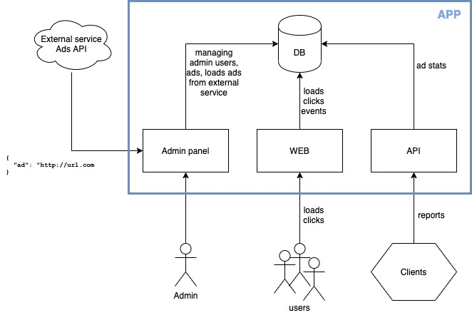

# Cloudinary Full-stack exercise

## Requirements

```
Ruby 2.7.0
PostgreSQL
```

## How to run

```bash
bundle install
rake db:setup
rails s
```

## master.key

```
ff6017630e9d30162d647148405c5ccc
```

## Architecture diagram



## Admin

```
/admin
```
Credentials: `admin@example.com` / `password`

## Loading Ads

```
Admin panel > Ads > Load ads
```

URL to the external Ad service (mock) in the config file: `config/settings.yml`

## Home `/`

List of Ads (URLs) to track.

## API

```
GET /api/v1/ad_stats_reports
```
### Params

`date`: date in format `YYYY-MM-DD`. Default today.

### Authentication

Token based authentication. Token in file: `config/settings.yml`

### Response

Array of stats in format:
```json
{
  "name": <ad-name>,
  "url": <ad-url>,
  "loads": <number-of-loads-in-given-day>,
  "clicks": <number-of-clicks-in-given-day>
}
```

### Example request

```
GET /api/v1/ad_stats_reports?date=2020-03-22
```

### Example response

```json
[
  {
    "name": "beatae",
    "url": "http://predovicklein.com/john",
    "loads": 10,
    "clicks": 0
  },
  {
    "name": "voluptatem",
    "url": "http://hegmann.name/micaela.hudson",
    "loads": 10,
    "clicks": 0
  },
  {
    "name": "repellat",
    "url": "http://legroskris.name/te",
    "loads": 10,
    "clicks": 1
  },
  {
    "name": "modi",
    "url": "http://brekke.io/delmar",
    "loads": 10,
    "clicks": 0
  }
]
```
